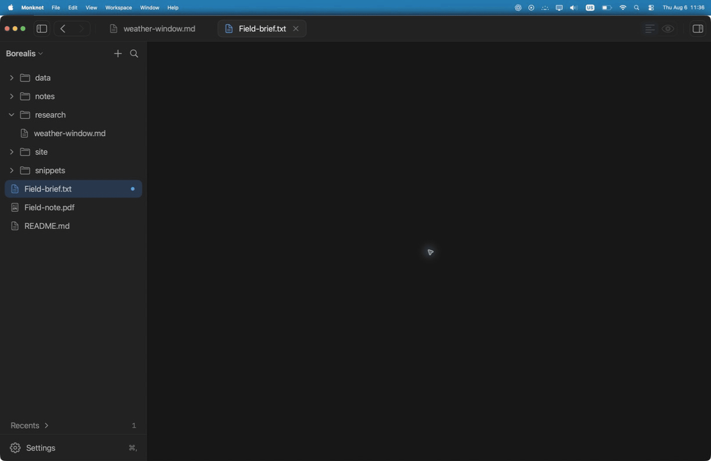

  

<h1 align="center">Monknot</h1>

Monknot is a native macOS app for editing Markdown, HTML, source code, and plain
text directly in local folders. It also previews and exports Markdown, searches
and annotates PDFs, and runs multiple terminal sessions.

Optional writing assistance corrects spelling and grammar inline. On supported
Macs with macOS 26, Apple’s on-device model adds reviewed sentence repairs and
short completions.

  

  macOS 14 or later · Apple silicon

  <a href="https://monknot.app">Website</a>
  ·
  <a href="https://github.com/RojhatToptamus/monknot/releases">Releases</a>
  ·
  <a href="https://monknot.app/support">Support</a>

 

  

  Split · Markdown source and rendered output, scrolling in sync

## Capabilities

- **Local files:** Monknot reads and writes supported files in place. It does
  not import them into a separate library.
- **Markdown:** Edit with syntax highlighting, formatting controls, tabs, Quick
  Open, heading navigation, daily notes, and wikilinks.
- **Preview and export:** Render Markdown beside the source with synchronized
  scrolling, or use a full-width preview. Export Markdown to PDF with page and
  layout controls.
- **Search and replace:** Search text files and selectable PDF text across a
  folder. Preview and scope multi-file replacements, then undo the last batch.
- **PDF:** Add highlights, underlines, strikeouts, drawings, and text boxes.
  Export annotations to Markdown or save an annotated PDF copy.
- **Terminal:** Run multiple `zsh` sessions in the active document or workspace
  folder. Search the bounded scrollback for each session.

### Writing assistance

Monknot uses macOS spelling and grammar services for inline typo fixes and
reviewed corrections in Markdown, `.txt`, and `.text` files. System inline
predictions can also suggest text as you type.

On macOS 26, you can enable **On-device writing assistance (Beta)**. It uses
Apple Intelligence for reviewed sentence repairs and short completions. The
option is off by default and requires a supported Mac, language, and enabled
model. Press Tab to accept the next word, or hold Tab to accept the full
completion.

Apple Writing Tools are available on macOS 15.2 or later when macOS reports
that they are ready.

  <picture>
    <source media="(prefers-color-scheme: light)" srcset="website/shots/writing-assistance-light.gif">
    <source media="(prefers-color-scheme: dark)" srcset="website/shots/writing-assistance.gif">
    
  </picture>

  Inline typo fixes · Reviewed sentence repairs · On-device completions · Apple Writing Tools

  
  

  PDF · Terminal

## Install

1. Download the latest Apple-silicon DMG from [GitHub Releases](https://github.com/RojhatToptamus/monknot/releases).
2. Open the DMG and drag **Monknot** into **Applications**.
3. Open Monknot.

Release downloads are signed with a Developer ID certificate and notarized by Apple.

## Useful shortcuts

| Action | Shortcut |
| --- | --- |
| Quick Open | <kbd>⌘ P</kbd> |
| Go to Heading | <kbd>⇧ ⌘ O</kbd> |
| Show Writing Tools | <kbd>⌃ ⌘ R</kbd> |
| Toggle split editor | <kbd>⌘ \</kbd> |
| Toggle terminal | <kbd>⌥ ⌘ J</kbd> |

## License

Monknot is available under the [MIT License](LICENSE). Third-party components
remain subject to their respective license terms in
[THIRD_PARTY_NOTICES.md](THIRD_PARTY_NOTICES.md).
