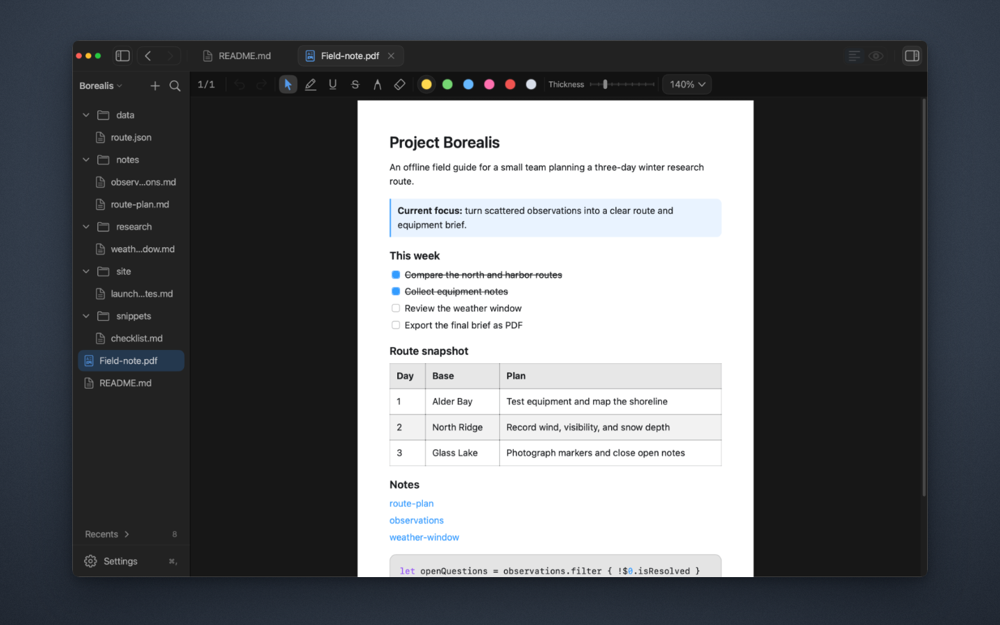
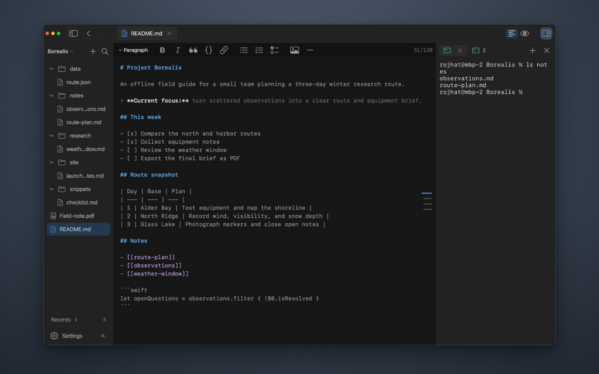

  

<h1 align="center">Monknot</h1>

  <strong>Markdown, PDFs, and a terminal. One window.</strong>

  Write in Editor. Keep source and output together in Split. Read in Preview. 
  Search and annotate PDFs. Run Terminal sessions beside the active document.

  

  macOS 14 or later · Apple silicon

  <a href="https://monknot.app">Website</a>
  ·
  <a href="https://github.com/RojhatToptamus/monknot/releases">Releases</a>
  ·
  <a href="https://monknot.app/support">Support</a>

 

  

  Split · Markdown source and rendered output, scrolling in sync

## Editor, Split, Preview, PDF, and Terminal

**Editor** — Write Markdown and plain text with syntax highlighting, document
tabs, search, and a formatting bar when you want one.

**Split** — Keep source and rendered output side by side, scrolling in sync.

**Preview** — Read the rendered document full width, including tables, task
lists, code blocks, links, and images.

**PDF** — Search documents and add highlights, underlines, strike-throughs, and
freehand marks. Markdown exports to PDF.

**Terminal** — Run several shell sessions beside the active document and switch
between them without leaving Monknot.

  
  

  PDF · Terminal

## Install

1. Download the latest Apple-silicon DMG from [GitHub Releases](https://github.com/RojhatToptamus/monknot/releases).
2. Open the DMG and drag **Monknot** into **Applications**.
3. Open Monknot.

Release downloads are signed with a Developer ID certificate and notarized by Apple.

## Useful shortcuts

| Action | Shortcut |
| --- | --- |
| Quick Open | <kbd>⌘ P</kbd> |
| Go to Heading | <kbd>⇧ ⌘ O</kbd> |
| Toggle split editor | <kbd>⌘ \</kbd> |
| Toggle terminal | <kbd>⌥ ⌘ J</kbd> |
| Open the shortcut guide | <kbd>?</kbd> |

## License

Monknot is available under the [MIT License](LICENSE). Third-party components
remain subject to their respective license terms in
[THIRD_PARTY_NOTICES.md](THIRD_PARTY_NOTICES.md).
