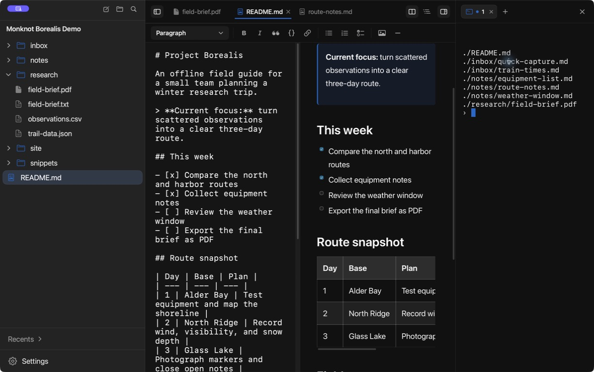

  

<h1 align="center">Monknot</h1>

  A macOS workspace for Markdown, text files, PDFs, and the terminal.

  <a href="https://github.com/RojhatToptamus/monknot/releases">Download Monknot</a>

  

Monknot opens a folder as a workspace and edits its files in place. There is
nothing to import and no account to create.

## Features

- Browse the folder in the sidebar. Use tabs, recent files, or Quick Open to
  move between documents. Create, rename, move, and delete files from the app.
- Markdown can be edited as source, read as a rendered document, or shown in a
  synchronized split view. The preview handles tables, task lists, code blocks,
  links, and images. HTML has a live split preview too.
- Search works in one document or across the folder, including text inside
  PDFs. Workspace replace shows a preview first, can target selected results,
  and can undo the last batch.
- PDFs open in tabs and support search, highlights, underlines, strike-throughs,
  and freehand marks. Markdown documents can be exported to PDF.
- The built-in terminal opens beside the document and starts in the relevant
  folder. Multiple terminal tabs can keep separate commands running.
- Use headings, related notes, `[[` link completion, and dated Daily Notes to
  navigate a collection. Choose a light or dark theme and adjust text size and
  editor preferences.

Monknot also watches the files on disk. Changes made in another app appear
automatically; if one conflicts with unsaved work, Monknot asks which version
to keep.

## Useful shortcuts

| Action | Shortcut |
| --- | --- |
| Quick Open | <kbd>⌘ P</kbd> |
| Find in workspace | <kbd>⇧ ⌘ F</kbd> |
| Go to Heading | <kbd>⇧ ⌘ O</kbd> |
| Daily Note | <kbd>⇧ ⌘ N</kbd> |
| Toggle split editor | <kbd>⌘ \</kbd> |
| Toggle terminal | <kbd>⌥ ⌘ J</kbd> |
| Open the full shortcut guide | <kbd>?</kbd> |

## Install on macOS

Monknot requires macOS 14 or later and currently supports Apple silicon Macs.

1. Download the DMG for your Mac from
   [GitHub Releases](https://github.com/RojhatToptamus/monknot/releases).
2. Open the DMG.
3. Drag **Monknot** into **Applications**.
4. Open Monknot and choose a folder.

Release downloads are signed with a Developer ID certificate and notarized by
Apple. Do not bypass Gatekeeper for an artifact that macOS cannot verify.

## License

Monknot is available under the [MIT License](LICENSE).

Third-party components remain subject to their respective license terms.
