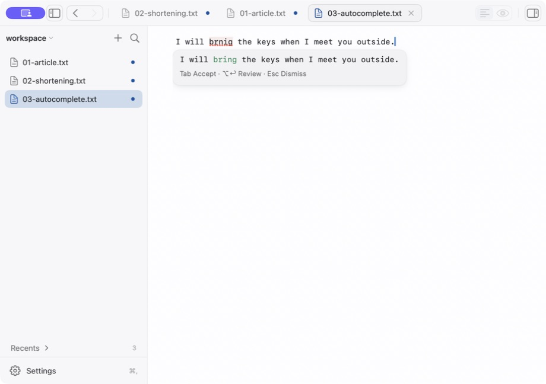
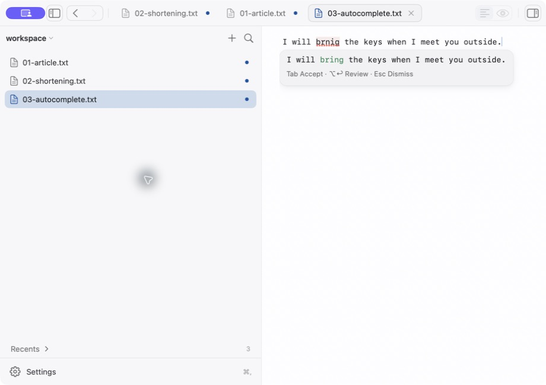

# Monknot Flow signed-app QA follow-up — 2026-08-16

This file contains targeted timed follow-ups and a later full fixed-sample rerun of the [original signed-app run](FlowWritingCorpusQARun-2026-08-16.md).

The original record remains unchanged except for links to its preserved screenshots.

## Run identity

- Executed app: `Monknot Flow Final Check`.
- Bundle ID: `com.monknot.flowqa.final03`.
- Diagnostic build: enabled.
- Architecture: arm64.
- Signature: ad hoc. Deep and strict code-signature validation passed.
- Source executable SHA-256 before clone re-sign: `64a5285342cc3dbd76fa15949741d5385eab67f4fe231244ca184938d42f27f9`.
- Executed clone SHA-256 after re-sign: `775d71f07c65457e2d5c232bc281a4c731107dca97338c87b04c987c58709790`.
- Executed app CDHash: `82756c20532a17dd32f0f887d30576e15c9ae8ec`.
- Host: macOS 26.5.1, build 25F80.

The first four checks are timed direct observations of the signed app. A later section records a complete fixed 20-case rerun on the same clone.

AX labels and actions were inspected. VoiceOver spoken order was not tested.

## Observation 1 — `repair-exact-003`

~~~text
I attached a updated estimate for the client meeting.
~~~

- Surface: direct at 550 ms.
- Visible proposal: `I attached an updated estimate for the client meeting.`
- Action: Tab applied the visible proposal.
- Undo: restored the exact source text.
- Redo: restored the exact correction.
- Result: PASS. The exact `a` to `an` correction completed through the editor path.

## Observation 2 — `repair-exact-023`

~~~text
The release checklist [verfy backups and notifiy owners] is ready for the rehearsal,
and Project Cedar have no other blocking issue.
~~~

- Surface: review-only at 491 ms. It never appeared as a direct repair.
- Apple proposal: `verfy` to `very` and `notifiy` to `notify`.
- Tab: did not mutate the source. It opened exactly one AX `Writing correction review` group.
- Review state: the editor exposed no Flow AX help or custom actions while the review was open.
- Cancel: restored the compact review cue.
- Escape: dismissed the cue. The source stayed exact.
- Containment result: PASS. The incorrect proposal cannot apply through the direct Tab path.
- Proposal result: FAIL. `very` remains an incorrect Apple proposal available only for explicit review.

The review-only result is not a correct repair. A user can still select Replace after reviewing the incorrect proposal.

## Observation 3 — custom autocomplete

The on-device Beta option was enabled before this observation. In the strings below, `␠` means one trailing U+0020 space.

- Context: `The support team reviewed the latest release notes and␠`.
- Visible completion at 2,804 ms: `found several bugs␠`.
- Option-Right accepted only `found␠`.
- Remaining visible completion: `several bugs␠`.
- Tab accepted the remainder.
- Full text: `The support team reviewed the latest release notes and found several bugs␠`.
- Undo and redo: restored the partial and full acceptance states.
- Result: PASS. Partial and full acceptance used the real editor path.

## Observation 4 — `repair-exact-001` in light and narrow layouts

~~~text
I will brnig the keys when I meet you outside.
~~~

- Surface: direct at 436 ms in light mode.
- Visible proposal: `I will bring the keys when I meet you outside.`
- Layout: the native sidebar divider moved to position 440.
- Narrow width: the editor pane was approximately 479 px wide.
- Result: PASS. The complete compact cue stayed visible and unclipped at both widths.

SHA-256: `d8d3effd7694ba800a30eb67644137d73537b645d196b7a7dbe1a0376895dbc0`.

SHA-256: `69a6633782d6b6b00418f3ebf23653797a3ab74d540a6dc4448840647600fddb`.

## Full fixed-sample rerun — completed 2026-08-17

The same final03 clone ran all 20 seeded sample IDs: exactly 10 were typed and 10 used real Command-V paste; 13 documents were Markdown and seven were plain text. The exact frozen inputs are recorded under the same IDs in [the fixed QA document](FlowWritingCorpusQA.md) and the [original run](FlowWritingCorpusQARun-2026-08-16.md). They were reused byte-for-byte except where this table explicitly records an AppKit native correction before the trigger.

The app UI did not expose the checker issue count, request owner, or internal terminal reason. This record does not infer them. Exact first-visible latency was not measured in this rerun: `+2.5 s` and `+10 s` are inspection windows, not proposal latencies.

| Case | Input path and trigger | Exact visible Flow surface | Result at inspection |
|---|---|---|---|
| 01 `repair-exact-001` | Typed Markdown; `.` | Direct: `I will bring the keys when I meet you outside.` | Visible by +2.5 s. Tab applied it; undo restored the exact source and redo restored the correction. AX attributed this run to on-device writing assistance. |
| 02 `repair-exact-002` | Pasted text; `.` | Autocomplete only: ` They will review it and provide ` | Visible by +2.5 s. Escape dismissed it; source unchanged. No Sentence Repair appeared. |
| 03 `repair-exact-003` | Typed Markdown; `.` | Direct: `I attached an updated estimate for the client meeting.` | Visible by +2.5 s. Unaccepted; source unchanged. AX attributed it to Apple spelling and grammar. |
| 04 `repair-exact-004` | Pasted text; `.` | Autocomplete only: ` We will review the questions and provide ` | Visible by +2.5 s. Unaccepted; source unchanged. No Sentence Repair appeared. |
| 05 `repair-exact-005` | Typed Markdown; `.` | Direct: `I need to reschedule my appointment because I have a fever.` | Visible by +2.5 s. Unaccepted; source unchanged. |
| 06 `repair-exact-013` | Pasted text; `.` | Direct: `The engineers are testing the backup process before tonight.` | Visible by +2.5 s. Unaccepted; source unchanged. |
| 07 `repair-exact-014` | Typed Markdown; `.` | Review-only: `We scheduled a review in Monday for the new prototype.` | Visible by +2.5 s. It corrected only `an` to `a`. Exactly one review opened. Cancel restored the cue and exact source. Replace applied the visible proposal; undo and redo passed. |
| 08 `repair-exact-015` | Pasted text; `.` | Direct: `after lunch Priya will check the figures and send the summary.` | Visible by +2.5 s. It omitted capitalization and comma changes. Unaccepted; source unchanged. |
| 09 `repair-exact-016` | Typed Markdown; `.` | No Flow surface | Observed through +2.5 s. AppKit had changed `confrim` to `confirm` before the trigger but retained `adress`; final visible text was `Can you confirm the adress before we leave.` |
| 10 `repair-exact-017` | Pasted text; `.` | Direct: `The meeting notes were uploaded to the shared folder.` | Visible by +2.5 s. Unaccepted; source unchanged. |
| 11 `repair-exact-021` | Typed Markdown; `.` | Review-only: `The technical review found no critical risks during the first pass,` `but the second review found a critical deployment warning.` | Visible by +2.5 s. Native entry had already changed both `critcal` spellings to `critical`; Flow visibly proposed the remaining `tehcnical` and `revieiw` repairs. Unaccepted. |
| 12 `repair-exact-022` | Pasted text; `.` then `”` | Autocomplete only: ` The ` | Visible by +2.5 s. Unaccepted; source unchanged. No Sentence Repair appeared. |
| 13 `repair-exact-023` | Typed Markdown; `.` | Review-only: `The release checklist [very backups and notify owners] is ready for the rehearsal,` `and Project Cedar have no other blocking issue.` | Visible by +2.5 s. It contained the unsafe `verfy` to `very` replacement. It was not accepted and could not apply directly with Tab. |
| 14 `repair-exact-024` | Pasted text; `.` | No surface | Observed through +2.5 s; source unchanged. |
| 15 `repair-ai-001` | Typed Markdown; `.` | No surface | Observed through +10 s; source unchanged. The independent production-service probe and validator evidence in the original run explain this as a safe rejection, not a signed-UI terminal reason. |
| 16 `repair-protected-001` | Pasted Markdown; `.` | No surface | Observed through +2.5 s; protected inline code stayed exact. |
| 17 `repair-protected-002` | Typed Markdown; Return | No surface | Observed through +2.5 s; visible fenced code stayed exact. The trailing-newline state was not separately recorded. |
| 18 `repair-protected-003` | Pasted Markdown; `.` | No surface | Observed through +2.5 s; protected link destination stayed exact. |
| 19 `repair-protected-004` | Typed Markdown; `.` | Autocomplete only: ` check the weather ` | Visible by +2.5 s and left unaccepted; the protected URL stayed exact. |
| 20 `repair-protected-005` | Pasted Markdown; `.` | Autocomplete only: ` I'll go to the park and have a` | Visible by +2.5 s and left unaccepted; the protected email address stayed exact. |

### Rerun totals and interactions

- Sentence Repair surfaces: six direct and three review-only.
- Other outcomes: five autocomplete-only windows and six no-surface windows.
- Exact cases: six complete visible final proposals, three incomplete or incorrect proposals, and five without a Sentence Repair. Case 11's complete visible proposal followed two native entry corrections.
- Protected cases: all five protected fragments remained unchanged. The two visible completions were not accepted.
- The reported long case stayed unchanged after a 10-second no-surface window; its internal reason was not exposed by the signed UI.
- Case 01 exercised Tab, undo, and redo. Case 07 exercised one exclusive review, Cancel, Replace, undo, and redo.
- At 125% workspace zoom in dark mode and a 920 × 648 narrow window, the hard-wrapped case 11 review cue stayed unclipped and highlighted only the two proposed source spans.
- Switching documents hid the cue in the other document and restored the still-exact cue on return. Revising `tehcnical` to `technical draft` then cancelled the stale cue immediately.
- Reading System Settings for Increase Contrast hung in the accessibility driver. It was interrupted before any setting was clicked or changed. Increase Contrast, VoiceOver spoken order, 10 additional model/editor cases, and actual Writing Tools proofreading were not tested in this rerun.

### Rerun screenshots

The preselected screenshot cases remained 01, 02, 11, 15, and 18; the dark/narrow hard-wrap capture is an additional matrix screenshot.

- [`final03-fixed-01.jpeg`](FlowWritingQAScreenshots/2026-08-17-final03-fixed-01.jpeg): `51ad54e402c2c08e227e599a26391de27e671876b290406f0cf825b872c6b7a3`.
- [`final03-fixed-02.jpeg`](FlowWritingQAScreenshots/2026-08-17-final03-fixed-02.jpeg): `117c6d501268a1fea424c4759f723a413e0658ffc7d556a0b1067536a1f1fde0`.
- [`final03-fixed-11.jpeg`](FlowWritingQAScreenshots/2026-08-17-final03-fixed-11.jpeg): `3a1ce6cf40b2844950a601bda925fdafd8f4f848aa602ce43a4d5f2d2fdd06af`.
- [`final03-fixed-15.jpeg`](FlowWritingQAScreenshots/2026-08-17-final03-fixed-15.jpeg): `9ae1c73c03f66e621378d63a42c94e24285d2d14a8c55e522c0750a646905e79`.
- [`final03-fixed-18.jpeg`](FlowWritingQAScreenshots/2026-08-17-final03-fixed-18.jpeg): `00ca5b4d6fe9c37aed6280a895ecc4faf844eae72c848b3abcee04fa0d1becb0`.
- [`final03-dark-125-narrow-hardwrap.jpeg`](FlowWritingQAScreenshots/2026-08-17-final03-dark-125-narrow-hardwrap.jpeg): `0b1a16bff3b261c81ba1e0e83f8d7bd7d4000494029b1b0f5a522a29d3756da0`.

## Post-audit build boundary

The final source cleanup removed one production-dead validator overload and changed test/QA files only; it did not change a runtime call path. A new diagnostic bundle was nevertheless built and signed from that tree:

- Source executable SHA-256: `d22fbf96cd0bfb19d69698519bdcbcee1af22b3bceecd2ff0e428402733ceec6`.
- Isolated clone bundle ID: `com.monknot.flowqa.current04`.
- Clone executable SHA-256 after ad hoc re-signing: `24dfbfeff30115c09d37a46fb3d218b9f57860f262ff00b34f3976e70e5af5f6`.
- Candidate CDHash full digest: `994eb41d3e9714f07d6d85d4114f01ba3aafd061676f6960b6d074256675c8f9`.
- Deep and strict code-signature verification passed.

The accessibility driver did not return an app state for this clone and was interrupted after approximately 295 seconds. No current04 UI behavior is claimed. The complete fixed-sample observations above are from final03, before the production-dead overload was removed. The unrelated dirty original app remained untouched.

## Async spelling-candidate build boundary — 2026-08-17

A later runtime change superseded current04 as the latest build boundary. It does not rewrite the final03 observation: that build offered `very` for `repair-exact-023`.

The new implementation requests public NSSpellChecker candidates asynchronously only for missing-primary or shortening spelling results. Apple's primary remains first. Candidate alternatives are bounded, deduplicated, revalidated, and review-only.

- Diagnostic build: enabled.
- Source executable SHA-256 before clone re-sign: `7967c92adfb03c07f275869ef594c5461d57d207b47352a256eada10e1bc40f2`.
- Isolated clone bundle ID: `com.monknot.flowqa.q7967c92a`.
- Clone executable SHA-256 after ad hoc re-signing: `c083d0481738460b6b2d4caaf95c5e322d26fb4043f296599d450d15dba00779`.
- Executed app CDHash: `96ef01432a02164e960e5a7dd7699c3a531bc516`.
- Deep and strict code-signature verification passed.

### Automated hosted-editor evidence

This is automated hosted-editor evidence, not a signed-app observation. The regression supplies Apple's incorrect `very` primary and a validated `verify` candidate. It proves that review opens without mutation, selecting `verify` updates the complete proposal, Replace applies once, and undo and redo restore the exact texts. Separate regressions retain `coming` as the primary for `comming`, reject direct application of `combing`, ignore stale callbacks, enforce the candidate deadline, fail closed for multiple ambiguous ranges, and avoid candidate lookup for clear nonshortening corrections.

### Targeted latest-clone UI check

The accessibility driver did not return a usable app state and was interrupted after approximately 326 seconds. No latest-clone UI behavior is claimed, and neither targeted case was executed. Final03 remains the latest complete signed-app rerun; the hosted-editor evidence above is not a substitute.

This targeted check is not a full fixed-sample rerun and does not change the final03 totals. The unrelated dirty original app remained untouched.
